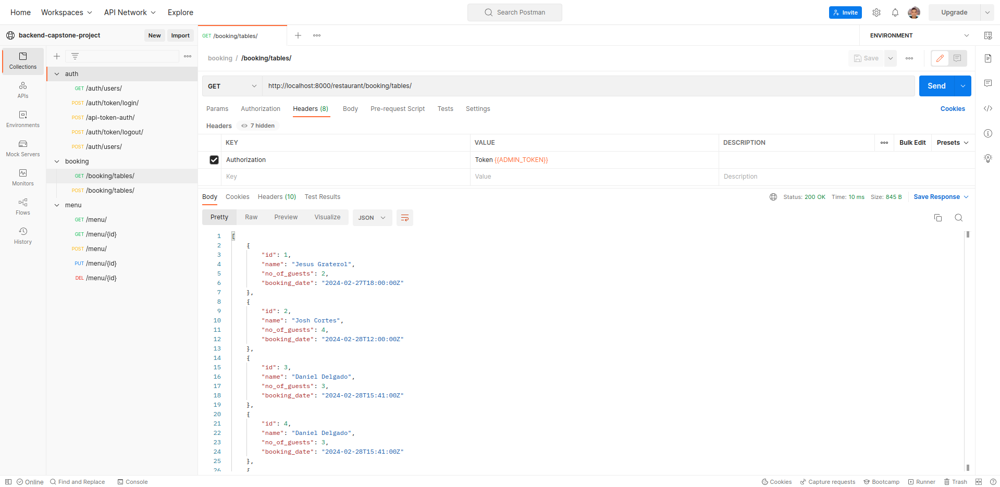

# Meta: Back-End Capstone Project

This repository serves as my personal submission for the [Back-End Capstone Project](https://www.coursera.org/learn/back-end-developer-capstone?specialization=meta-back-end-developer) offered by Meta through Coursera in the [Back-End Developer Professional Certificate](https://www.coursera.org/professional-certificates/meta-back-end-developer).





## Project Structure

```
backend-capstone-project-meta
    │
    littlelemon/
    │    ├───littlelemon/
    │    │       ├───asgi.py
    │    │       ├───settings.py
    │    │       ├───urls.py
    │    │       └───wsgi.py
    │    ├───restaurant/
    │    │       ├───migrations/
    │    │       |      └───...
    │    │       ├───static/
    │    │       |      └───...
    │    │       ├───templates/
    │    │       |      └───index.html
    │    │       ├───tests/
    │    │       |      ├───test_models.py
    │    │       |      └───test_views.py
    │    │       ├───admin.py
    │    │       ├───apps.py
    │    │       ├───serializers.py
    │    │       ├───models.py
    │    │       ├───permissions.py
    │    │       ├───serializers.py
    │    │       ├───urls.py
    │    │       └───views.py
    │    └───manage.py
    │
    README.md
```


## Getting Started

```bash
$ cd backend-capstone-project-meta/littlelemon

$ pipenv shell

$ pipenv install

$ python3 manage.py makemigrations 

$ python3 manage.py migrate

$ python3 manage.py runserver
```


## MySQL User Credentials

**User:** `admindjango`

**Password:** `employee@123!`


## `superuser` Credentials

**Username:** `admin`

**Email:** `admin@littlelemon.com`

**Password:** `admin@123!`


## Customer Credentials

**Username:** `customer`

**Email:** `customer@gmail.com`

**Password:** `cust@123!`


## Endpoints

[Postman Workspace](https://www.postman.com/jesusgraterol/workspace/backend-capstone-project)


## Grading Criteria

1. [x] Does the web application use Django to serve static HTML content?
2. [x] Has the learner committed the project to a Git repository?
3. [x] Does the application connect the backend to a MySQL database?
4. [x] Are the menu and table booking APIs implemented?
5. [x] Is the application set up with user registration and authentication?
6. [x] Does the application contain unit tests?
7. [x] Can the API be tested with the Insomnia REST client?